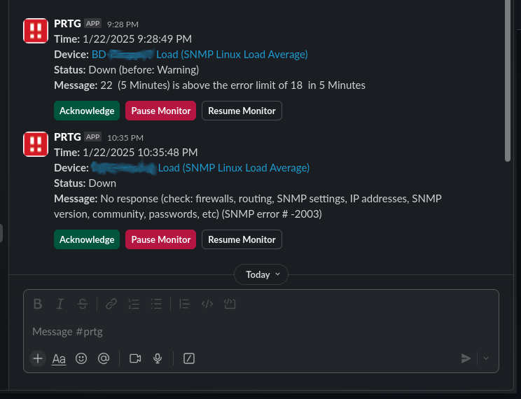
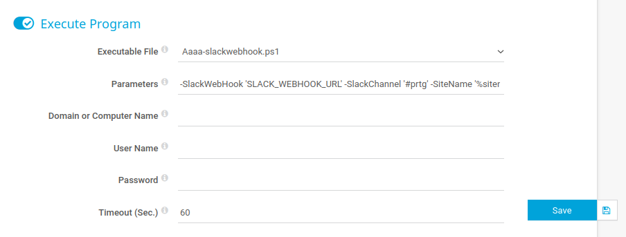

# PRTG to Slack Notification Integration

This integration enables PRTG monitoring alerts to be sent directly to Slack channels.

Example Notification:



## Prerequisites

- PRTG monitoring system
- Slack workspace with permissions to add webhooks
- PowerShell execution environment

## Installation

1. Save the script to:
```
C:\Program Files (x86)\PRTG Network Monitor\notifications\exe
```

2. Configure PRTG Executable Program for notifications:
[How can PRTG send notifications to Slack?](https://kb.paessler.com/en/topic/66113-how-can-prtg-send-notifications-to-slack#reply-216593)

## Setup Instructions

### 1. Slack Configuration
1. Create a dedicated Slack channel for PRTG notifications (e.g. `#prtg`)
2. Set up an Incoming Webhook for your Slack workspace
   - Save the Webhook URL for configuration

### 2. PRTG Configuration
1. Generate a PRTG API Token. Learn how to create the token here:
[How do I create an API key for Paessler PRTG OPC UA Server](https://kb.paessler.com/en/topic/91449-how-do-i-create-an-api-key-for-paessler-prtg-opc-ua-server#reply-317809)

## Command Line Parameters

1. Update parameters with your values:
   - Replace `SLACK_WEBHOOK_URL` with your Slack webhook URL
   - Set `SlackChannel` to your channel name
   - Update `PRTGServer` with your PRTG server URL
   - Replace `PRTG_API_TOKEN` with your generated API token



Use this line in your PRTG notification template Parameters line: Adjust with the above details

```
-SlackWebHook 'SLACK_WEBHOOK_URL' -SlackChannel '#prtg' -SiteName '%sitename' -Device '%device' -Name '%name' -Status '%status' -Down '%down' -DateTime '%datetime' -LinkDevice '%linkdevice' -Message '%message' -SensorID '%sensorid' -PRTGServer 'https://www.example-prtg-monitor.com' -APIToken 'PRTG_API_TOKEN'
```

Added -Debug flag that logs to "C:\prtgslackdebug.log". Just add -Debug to the end of your Parameters line in PRTG Notification template.

```
-SlackWebHook 'SLACK_WEBHOOK_URL' -SlackChannel '#prtg' -SiteName '%sitename' -Device '%device' -Name '%name' -Status '%status' -Down '%down' -DateTime '%datetime' -LinkDevice '%linkdevice' -Message '%message' -SensorID '%sensorid' -PRTGServer 'https://www.example-prtg-monitor.com' -APIToken 'PRTG_API_TOKEN' -Debug
```

## Security Notes

- Keep your API Token and Slack Webhook URL secure
- Use HTTPS for the PRTG server URL
- Regularly rotate the API Token
